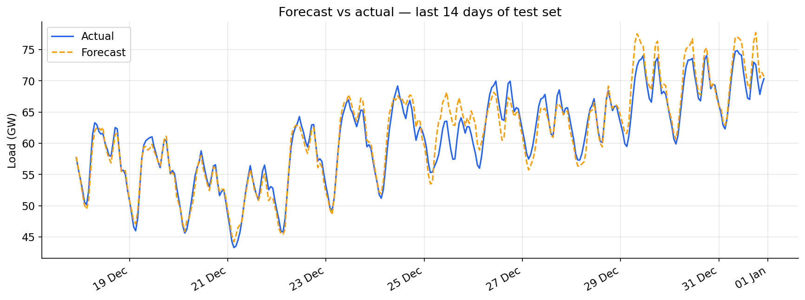
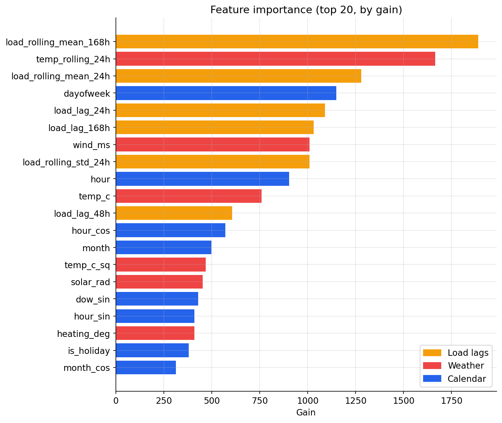

# ⚡ Electricity Demand Forecast — France

**A static website that presents a LightGBM model forecasting French next-day hourly electricity demand to within `1.78%` mean absolute error — roughly `3.9×` more accurate than the seasonal-naive baseline utilities typically quote.**

The model is trained on three years of real grid data from the ENTSO-E Transparency
Platform, enriched with population-weighted weather from Open-Meteo, and evaluated honestly
with **walk-forward validation** (no look-ahead bias). The site itself is plain
**HTML / CSS / JavaScript** — every number is pre-computed into a static `data.json`, so
there is **no server and no Python running at runtime.** It deploys as free static hosting.

> 🔴 **Live demo:** _add your deployed URL here once you've followed the steps below._

---

## 📈 Performance (90-day hold-out, walk-forward validated)

| Model | MAPE ↓ | MAE ↓ | Error vs. our model |
|---|---|---|---|
| **LightGBM (this project)** | **1.78 %** | **0.98 GW** | — |
| Yesterday-naive baseline | 5.02 % | 2.66 GW | 2.8× worse |
| Seasonal-naive baseline (same hour, last week) | 6.91 % | 4.00 GW | 3.9× worse |

- **MAPE 1.78 %** — mean absolute percentage error on data the model never saw in training.
- **MAE 0.98 GW** — under 1 GW of error on a system averaging ~49 GW.
- **−74 %** — the model cuts the seasonal-naive baseline's error by roughly three-quarters.

| Forecast vs. actual | Feature importance |
|---|---|
|  |  |

---

## 🖥️ The website (`docs/`)

A hand-built single page that foregrounds the model's performance: a hero with the headline
numbers, a baseline benchmark chart, an interactive "forecast any day" view (date picker +
24-hour chart + week context), and diagnostics (residuals, error-by-hour, feature importance).
All charts are interactive ([ECharts](https://echarts.apache.org/)).

```
docs/
├── index.html     # structure & content
├── styles.css     # the design
├── main.js        # loads data.json, renders every chart
└── data.json      # baked model outputs (regenerate with export_site_data.py)
```

### View it locally

The page uses `fetch()` to load `data.json`, so it must be served over HTTP (opening the
file directly with `file://` will not work):

```bash
python -m http.server --directory docs 8000
# then open http://localhost:8000
```

(Or use the VS Code **Live Server** extension and "Open with Live Server" on `docs/index.html`.)

### Regenerate the data after retraining

```bash
python export_site_data.py     # reads data/model + data/processed, writes docs/data.json
```

---

## 🚀 Deploy it online (free)

It's just static files — pick whichever you like.

### Option A — GitHub Pages (recommended, zero config)

1. Push this folder to a **GitHub** repo (git steps below).
2. On GitHub: **Settings → Pages**.
3. **Source: Deploy from a branch** → Branch **`main`**, folder **`/docs`** → **Save**.
4. Your site goes live at `https://<your-username>.github.io/<repo-name>/` in ~1 minute.

GitHub Pages serves the `/docs` folder directly, so the Python files in the repo root are
simply ignored by the site.

### Option B — Netlify / Vercel / Cloudflare Pages

Even simpler for a one-off: go to **[app.netlify.com/drop](https://app.netlify.com/drop)** and
drag the `docs` folder onto the page — you get a live URL instantly. To deploy from the repo
instead, connect it and set the **publish directory** to `docs` (no build command needed).

### First-time git push to GitHub

```bash
# from the project root
git init
git add .
git commit -m "Electricity demand forecast website"
git branch -M main
# create an empty repo at github.com/new first, then:
git remote add origin https://github.com/<you>/<repo>.git
git push -u origin main
```

> ✅ `.env` (your ENTSO-E API key) is already in `.gitignore` and will **not** be pushed.

---

## 🧠 How the model is built (the pipeline)

| Stage | Script | What it does |
|---|---|---|
| 1. Fetch | `fetch_data.py` | Pulls hourly load + generation (ENTSO-E) and weather (Open-Meteo), merges onto one clean UTC grid. _Requires an ENTSO-E API key in `.env`._ |
| 2. Features | `features.py` | Calendar terms (cyclically encoded), holidays, load lags & rolling stats, temperature (+ squared term), wind, solar radiation. |
| 3. Train | `train.py` | Trains LightGBM with early stopping, evaluates with walk-forward validation, saves the model + metrics + plots. |
| 4. Export | `export_site_data.py` | Bakes the model's outputs into `docs/data.json` for the website. |

**Why walk-forward validation?** Instead of training once and scoring all 90 test days at
once, the model is retrained on all prior data before each weekly block, then scored on it.
This mirrors real deployment and rules out any leakage of future information.

---

## 📂 Project structure

```
.
├── docs/                         # the static website (deploy this folder)
│   ├── index.html · styles.css · main.js · data.json
├── export_site_data.py           # model outputs -> docs/data.json
├── fetch_data.py / features.py / train.py   # the data → model pipeline
├── app.py                        # optional legacy Streamlit version of the dashboard
├── requirements.txt
├── data/
│   ├── processed/features.parquet
│   ├── model/{lgbm_model.txt, metrics.json, features.json}
│   └── plots/*.png
└── .env                          # local only — your ENTSO-E key (gitignored)
```

---

**Data:** [ENTSO-E Transparency Platform](https://transparency.entsoe.eu/) ·
[Open-Meteo](https://open-meteo.com/) — **Model:** LightGBM · **Site:** plain HTML/CSS/JS + ECharts
